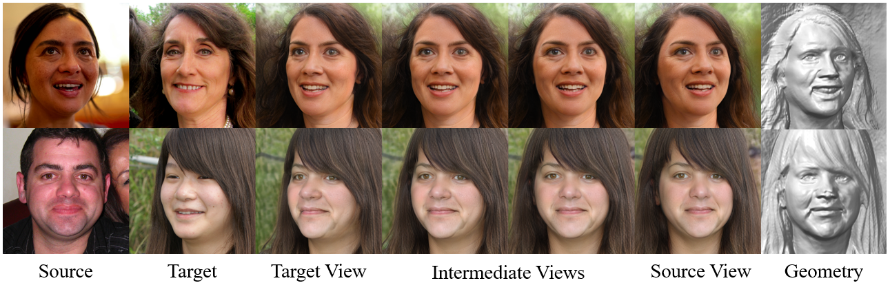
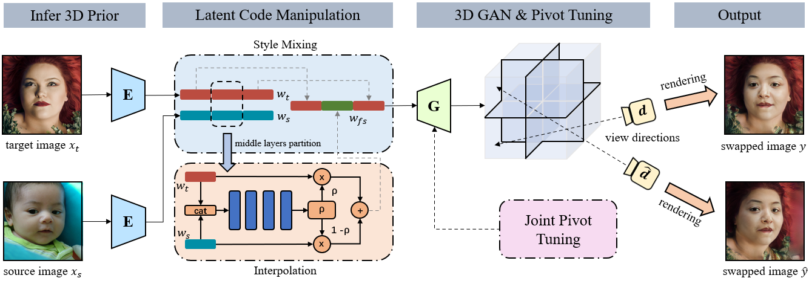

# Abstract

Face swapping is an important research topic in computer vision with wide applications in entertainment and privacy protection. Existing methods directly learn to swap 2D facial images, taking no account of the geometric information of human faces. In the presence of large pose variance between the source and the target faces, there always exist undesirable artifacts on the swapped face. In this paper, we present a novel 3D-aware face swapping method that generates high-fidelity and multi-view-consistent swapped faces from single-view source and target images. To achieve this, we take advantage of the strong geometry and texture prior of 3D human faces, where the 2D faces are projected into the latent space of a 3D generative model. By disentangling the identity and attribute features in the latent space, we succeed in swapping faces in a 3D-aware manner, being robust to pose variations while transferring fine-grained facial details. Extensive experiments demonstrate the superiority of our 3D-aware face swapping framework in terms of visual quality, identity similarity, and multi-view consistency. 

# Overview
## Framework


## Slideshow
<video width="850" playsinline autoplay loop preload muted controls>
  <source src="assets/media/slide_show.mp4" type="video/mp4">
</video>

# Project Demo
<video width="850" playsinline autoplay loop preload muted controls>
  <source src="assets/media/demo.mp4" type="video/mp4">
</video>

# Citation
```text
@InProceedings{Li_2023_CVPR,
    author    = {Li, Yixuan and Ma, Chao and Yan, Yichao and Zhu, Wenhan and Yang, Xiaokang},
    title     = {3D-Aware Face Swapping},
    booktitle = {Proceedings of the IEEE/CVF Conference on Computer Vision and Pattern Recognition (CVPR)},
    month     = {June},
    year      = {2023},
    pages     = {12705-12714}
}
```
